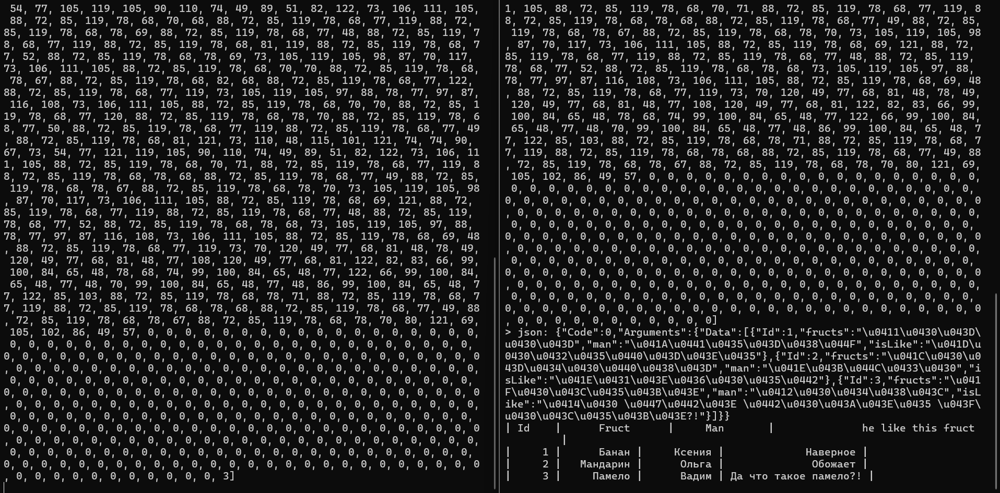
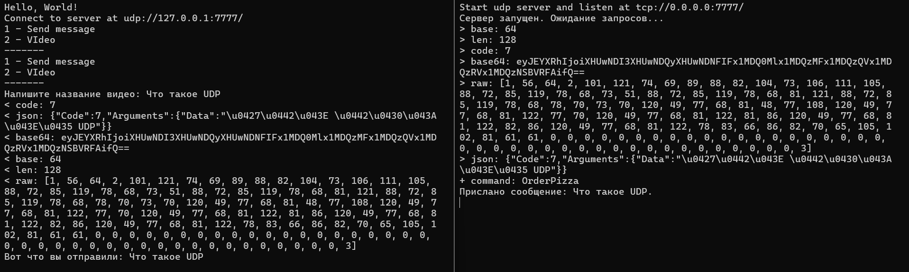

# Lab5.Network Application

## Описание проекта
Данный проект реализует клиент-серверное приложение с использованием TCP и UDP протоколов. Основная цель — управление списком пользователей и отправка сообщений.

## Основные функциональности

### TCP Клиент
Клиентская часть для работы с пользователями:
- **Просмотр списка пользователей.**
- **Получение информации о пользователе по ID.**
- **Добавление нового пользователя.**
- **Обновление информации о пользователе.**
- **Удаление пользователя.**

### UDP Клиент
Клиентская часть для работы с сообщениями:
- **Отправка сообщений.**
- **Отправка запросов на видео.**

### UDP Сервер
Серверная часть для обработки сообщений и заказов видео.

## Структура кода

### Основные классы

#### `UserApiClient`
Реализует взаимодействие с сервером для управления пользователями через TCP:
- `AddAsync(User newUser)` - добавляет нового пользователя.
- `DeleteAsync(int id)` - удаляет пользователя.
- `GetAllAsync()` - возвращает список всех пользователей.
- `GetAsync(int id)` - получает пользователя по ID.
- `UpdateAsync(int id, User updateUser)` - обновляет данные пользователя.

#### `MessageApiClient`
Реализует взаимодействие с сервером для работы с сообщениями через UDP:
- `SendMessage(string message)` - отправляет сообщение.
- `OrderVideo(string pizzaType)` - отправляет заказ видео.

#### `MessageUdpServer`
Обрабатывает команды, поступающие от UDP клиентов:
- `SendMessage(string message)` - обработка отправки сообщений.
- `OrderVideo(string pizzaType)` - обработка заказа видео.

### Основные файлы
- **`UserApiClient.cs`** - реализация TCP клиента для управления пользователями.
- **`MessageApiClient.cs`** - реализация UDP клиента для отправки сообщений.
- **`MessageUdpServer.cs`** - реализация сервера для обработки UDP команд.
- **`Program.cs`** - точка входа в приложение.

## Установка и запуск

### Требования
- .NET 6.0 или выше.
- Visual Studio 2022 или любая другая IDE, поддерживающая .NET.

### Установка
1. Клонируйте репозиторий:
   ```bash
   git clone https://github.com/KlyuchnikovaKA/labs/tree/master/fifthlab
   ```
2. Откройте проект в Visual Studio 2022.
3. Постройте решение (`Build Solution`).

### Запуск
1. Запустите сервер:
   - Перейдите в проект с сервером (например, `Lab5.Network.Server`).
   - Выполните запуск сервера.
2. Запустите клиент:
   - Перейдите в проект с клиентом (например, `Lab5.Network.Client`).
   - Выполните запуск клиента.

## Пример использования

### Меню управления пользователями (TCP)
```
1 - Вывести все фрукты
2 - Показать фрукт по id
3 - Добавить фрукт
4 - Изменить имя человека
5 - Удалить фрукт
-------
```

### Меню управления сообщениями (UDP)
```
1 - Send message
2 - Video
-------
```

## Пример кода

### Добавление нового пользователя
```csharp
var newUser = new User
{
    Id = 0,
    fructs = "Apple",
    man = "John",
    isLike = "да"
};
var result = await userApi.AddAsync(newUser);
Console.WriteLine(result ? "Добавлено успешно" : "Ошибка добавления");
```

### Отправка сообщения
```csharp
var message = "Hello, World!";
await messageApi.SendMessage(message);
Console.WriteLine("Сообщение отправлено");
```


## Работа программы




