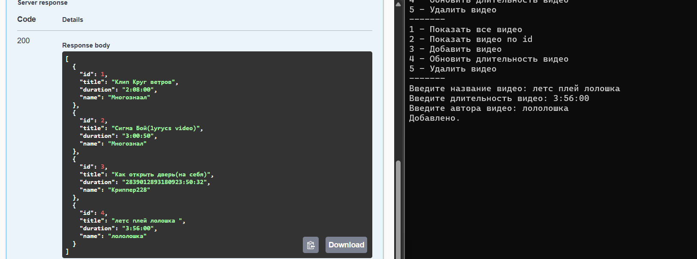

# Task Manager API

## Описание

Данный проект представляет собой клиент-серверное приложение для управления задачами. Приложение реализует API для работы с задачами (TaskItem), такими как добавление, удаление, обновление и просмотр задач. Клиент взаимодействует с сервером через HTTP-запросы.

## Функционал

### Серверная часть
Серверная часть предоставляет API для следующих операций:
- **Получение всех задач**
- **Получение задачи по ID**
- **Добавление новой задачи**
- **Обновление существующей задачи**
- **Удаление задачи**

Сервер также использует хранилище задач на основе `ConcurrentDictionary` и предоставляет методы для работы с задачами через интерфейс `ITaskApi`.

### Клиентская часть
Клиентская часть предоставляет консольное меню для взаимодействия с сервером. Пользователь может:
1. Просмотреть все задачи
2. Найти задачу по ID
3. Добавить новую задачу
4. Обновить длительность задачи
5. Удалить задачу по ID
6. Выйти из приложения

## Структура проекта

### Основные компоненты
1. **TaskItem**
   Класс, представляющий задачу с полями:
   - `Id` (идентификатор задачи)
   - `Title` (название задачи)
   - `Duration` (длительность задачи)
   - `Name` (имя автора задачи)

2. **TaskApiClient**
   Класс клиента для отправки HTTP-запросов к серверу. Реализует интерфейс `ITaskApi`.

3. **TaskStorage**
   Класс, реализующий серверное хранилище задач с использованием `ConcurrentDictionary` и методов для сериализации/десериализации данных.

4. **Program**
   Главный класс, содержащий:
   - Серверную часть для запуска API
   - Клиентскую часть для управления задачами через консольное приложение

5. **IDataSerializer**
   Интерфейс для сериализации/десериализации данных.

6. **JsonDataSerializer**
   Реализация `IDataSerializer` с использованием JSON для сохранения данных.

## Требования к окружению

- .NET 6.0 или выше
- Visual Studio 2022 или другой поддерживаемый IDE
- Браузер для работы с Swagger (опционально)

## Запуск приложения

### Клиентская часть
1. Настройте URL API-сервера в коде клиента (в классе `Program`, поле `BaseAddress`).
2. Запустите консольное приложение.
3. Следуйте инструкциям в консольном меню.

## Использование API

### Пример HTTP-запросов

#### Получение всех задач
```
GET /api/Task
```
Ответ:
```json
[
    {
        "id": 1,
        "title": "Клип Круг ветров",
        "duration": "2:08:00",
        "name": "Многознаал"
    }
]
```

#### Добавление задачи
```
POST /api/Task
{
    "title": "Новая задача",
    "duration": "1:00:00",
    "name": "Автор"
}
```
Ответ: 201 Created

#### Обновление задачи
```
PUT /api/Task/1
{
    "id": 1,
    "title": "Обновленная задача",
    "duration": "2:30:00",
    "name": "Автор"
}
```
Ответ: 200 OK

#### Удаление задачи
```
DELETE /api/Task/1
```
Ответ: 200 OK

## Дополнительные сведения

1. **Swagger**: Используется для тестирования и документации API.
2. **ConcurrentDictionary**: Используется для потокобезопасного хранения данных на сервере.
3. **Сериализация данных**: Реализована через JSON для сохранения и загрузки задач в/из файла.


### Работа программы
